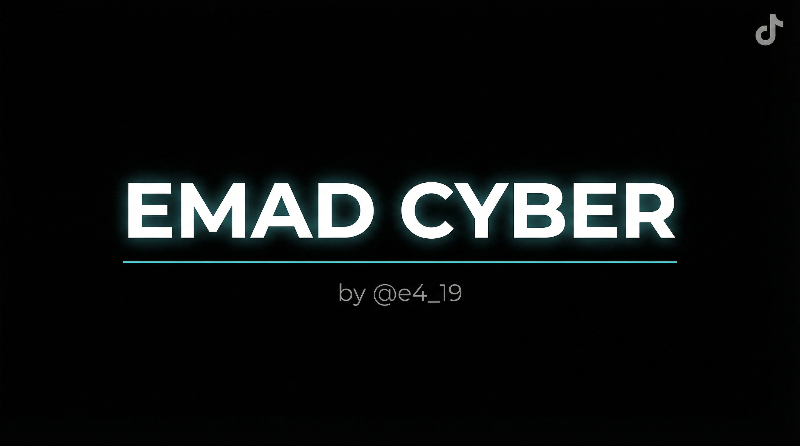

<div align="center">



# 🔍 EMAD CYBER — TikTok Info Tool

**أداة OSINT لاستخراج معلومات حسابات تيك توك**


</div>

---

## 📌 وصف الأداة

**EMAD CYBER** هي أداة مكتوبة بلغة Python تتيح استخراج المعلومات العامة لأي حساب تيك توك عن طريق اسم المستخدم فقط.

---

## ✨ المعلومات التي تستخرجها الأداة

| المعلومة | الوصف |
|----------|--------|
| 👤 **Username** | اسم المستخدم |
| 🔑 **SecUID** | المعرف الأمني للحساب |
| 📛 **Name** | الاسم الكامل |
| 👥 **Followers** | عدد المتابعين |
| 📲 **Following** | عدد المتابَعين |
| ❤️ **Likes** | عدد الإعجابات |
| 🎬 **Videos** | عدد الفيديوهات |
| 🔒 **Private** | هل الحساب خاص؟ |
| 🌍 **Country** | الدولة |
| 📅 **Created Date** | تاريخ إنشاء الحساب |
| 🆔 **User ID** | المعرف الفريد |
| 📝 **Bio** | السيرة الذاتية |

---

## ⚙️ المتطلبات

- Python 3.x
- اتصال بالإنترنت

---

## 📦 التثبيت

```bash
# 1. استنساخ المستودع
git clone https://github.com/your-username/imadtik.git
cd imadtik

# 2. تثبيت المكتبات المطلوبة
pip install -r requirements.txt

# 3. تشغيل الأداة
python imadtik.py
```

---

## 🚀 طريقة الاستخدام

```
Enter TikTok Username: username_here
```

### مثال على النتيجة:

```
[+] ACCOUNT INFORMATION
───────────────────────────────────────────────────────
Username     : example_user
SecUID       : MS4wLjABAAAA...
Name         : Example Name
Followers    : 10000
Following    : 500
Likes        : 250000
Videos       : 120
Private      : false
Country      : Saudi Arabia 🇸🇦
Created Date : 2020-03-15 12:30:00
User ID      : 123456789
───────────────────────────────────────────────────────
Bio: This is the bio text
```

---

## 🗂️ هيكل المشروع

```
imadtik/
├── imadtik.py          # الأداة الرئيسية
├── requirements.txt    # المكتبات المطلوبة
├── banner.png          # صورة الأداة
└── README.md           # هذا الملف
```

---

## ⚠️ إخلاء المسؤولية

> هذه الأداة مخصصة **للأغراض التعليمية والبحثية فقط**.
> لا تتحمل المسؤولية عن أي استخدام غير قانوني أو غير أخلاقي لهذه الأداة.
> يُرجى الالتزام بـ [شروط خدمة TikTok](https://www.tiktok.com/legal/terms-of-service) و[سياسة GitHub للاستخدام المقبول](https://docs.github.com/en/site-policy/acceptable-use-policies/github-acceptable-use-policies).

---

## 👨‍💻 المطور

<div align="center">

**EMAD CYBER**

Made with ❤️ by [@e419x](https://github.com/e419x)

</div>
